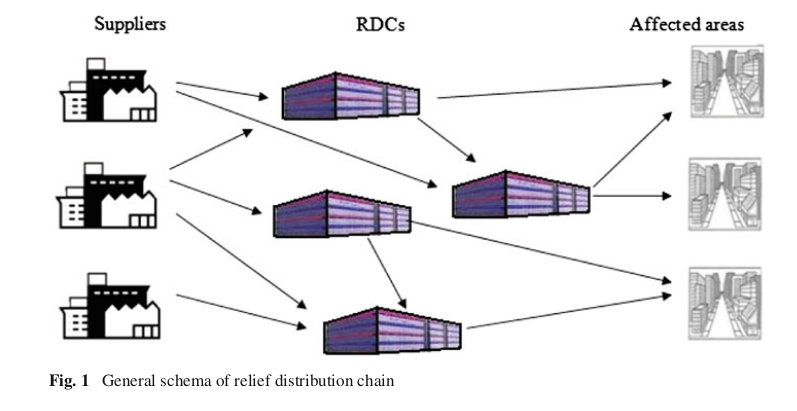
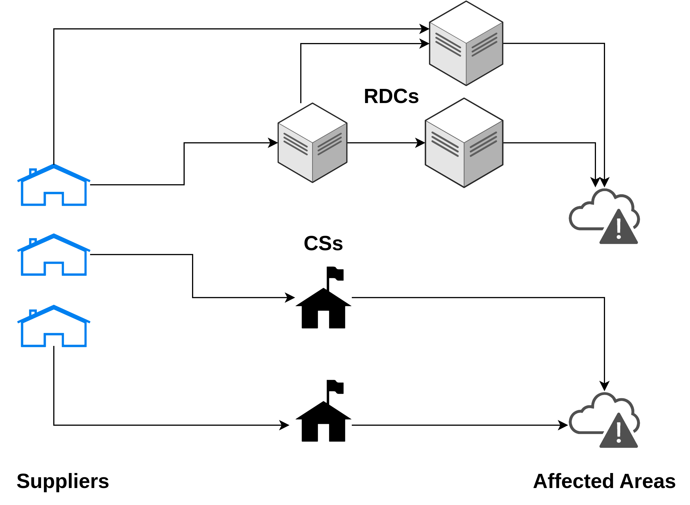
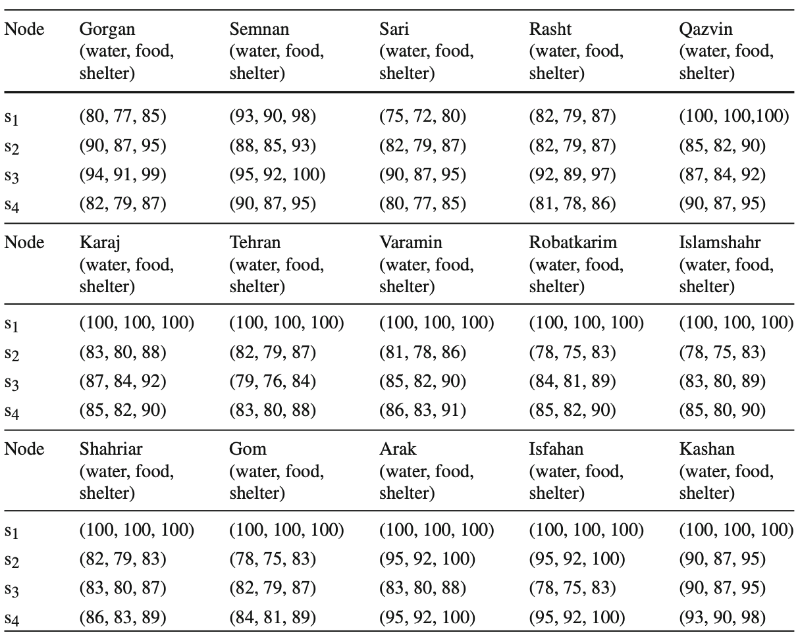

## ORA Term Project 2022
### Disaster Relief Logistics with Contactless Delivery Policy

### 2022 Fall
Team B

資訊所一 楊晴雯 P76114511

資訊所一 許智豪 P76114503

---
## Table of Contents
1. [Introduction](#Introduction)
    1.1 [Background: Disaster Relief Logistics](#Background:-Disaster-Relief-Logistics)
    1.2 [Motivation](#Motivation)
    1.3 [Abbreviations](#Abbreviations)

## Introduction
### Background: Disaster Relief Logistics

Our project is inspired by "A multi-objective robust stochastic programming model for disaster relief logistics under uncertainty" by Ali bozorgi-Amiri et al, published on *OR Spectrum* in year 2011. Their model is a multi-objective model that aims to minimizes the total cost and its variance (as the first objective), and maximizes the satisfaction level of the least satisfied affected area (as the second objective). Since the disaster scale is stochastic, their model proposes to use discrete scenario analysis to include the stochastic factors.

### Abbreviations

RDC: Resource Distribution Center
CS: Contactless Station
AA: Affected Area

### Amiri's Paper Setting

### Motivation
As Covid-19 threats gradually becomes a normality, it is a must to consider how to respond to a disaster under the pandemic. An imaginary scenario is that an earthquake damages a hospital that quarantines many Covid-19 confirmed cases, and now the resources need to be sent to this hospital without further human contacts. In this case, some contactless stations (CSs) need to be set up in place of the Amiri's proposed RDCs. CSs send resources via self-driving cars, therefore avoids the risk brought by frequent human mobility in between. It also reduces the transportation costs because no drivers are needed, and the capacity of a CS could be

### Our Setting

## Formulation

- Sets and Indices

    - $I$: Suppliers
    - $J$: Candidate points for RDCs and CCs
    - $K$: Affected Areas
    - $I$, $J$ and $K$ are disjoint sets. For each $j \in J$, it is could be an RDC, or a CS, or none of the above, just an empty point.
    - $K'$: High-risk Affected Areas; Affected Areas that only receive commodities transported by CSs.
    - $K/K'$: Low-risk Affected Areas; Affected Areas that only receive commodities transported by RDCs.
    - $C$: Commodity Types.
    - $S$: Possible scenarios (discrete).

- Parameters

    (Deterministic Parameters)

    - $F^R$: fixed setup cost for RDCs.
    - $F^C$: fixed setup cost for CSs.
    - $C_{ijc}$: transportation cost from supplier $i$ to candidate point $j$ with commodity $c$.
    - $h_{kc}$: inventory holding cost for commodity $c$ at AA $k$.
    - $\pi_{c}$: inventory shortage cost for commdotiy $c$.
    - $v_{c}$: required unit space for commodity $c$.
    - $S_ic$: amount of commodity $c$ supplied by supplier $i$.
    - M: a large number

    (Stochastic Parameters)

    - $p_s$: occurrence of probability of scenario $s \ in S$.
    - $C_{ijcs}$: transportation cost from supplier $i$ to candidate point $j$ with commodity $c$ under scenario $s$.
    - $C_{jkcs}$: transportation cost from candidate point $j$ to AA $k$ with commodity $c$ under scenario $s$.
    - $D_{kcs}$: amount of demand of commodity $c$ under scenario $s$.
    - $\rho_{jcs}$: fraction of stocked materials of commodity $c$ remains usable at candidate point $j$ under scenario $s$ ($0 \leq \rho_{jcs} \leq 1$)
    - $\rho_{ics}$: fraction of stokced materials of commodity $c$ remains usdables at supplier $i$ under scenario $s$ ($0 \leq \rho_{ics} \leq 1$)

- Decision Variables

    - $Q_{ijc}$: amount of commodity $c$ supplied by supplier $i$, stored at candidate point $j$.
    - $X_{ijcs}$: amount of commodity $c$ transferred from supplier $i$ to candidate point $j$ under scenario $s$. If $X_{ijcs} > 0, j$ must be either an RDC or a CS.
    - $Y_{jkcs}$: amount of commodity $c$ transferred from candidate point $j$ to AA $k$ under scenario $s$. If $Y_{jkcs} > 0, j$ must be either an RDC or a CS.
    <!-- - $Y'_{j'jcs}$: amount of commodity $c$ transferred from candidate point $j'$ to another candidate point $j$ under scenario $s$. If $j' = j$, then $Y'_{j'jcs} = 0$. -->
    - $I_{kcs}$: amount of inventory of commodity $c$ held at AA $k$ under scenario $s$.
    - $b_{kcs}$: amount of shortage of commodity $c$ at AA $k$ under scenario $s$.
    - $\alpha_i$: if candidate point $j$ is an RDC, $\alpha_j = 1$; otherwise $=0$.
    - $\beta_j$: if candidate point $j$ is a CS, $\beta_j = 1$; otherwise $=0$.

- Mathematical Formulations

    These are defined for convenience and the simplicity in objective functions.

    - $\Sigma_{j \in J}(F^R\alpha_j + F^C\beta_j)$: (SC) Setup Cost for RDCs and CSs
    - $\Sigma_{i\in I}\Sigma_{j \in J}\Sigma_{c \in C}C_{ijc}Q_{ijc}$: Transportation Cost from suppliers to RDCs and CSs (preparedness phase).
    - $\Sigma_{i\in I}\Sigma_{j \in J}\Sigma_{c \in C}C_{ijcs}X_{ijcs}$:(TC-pre) Transportation Cost from suppliers to RDCs and CSs under a scenario (response phase).
    - $\Sigma_{i\in I}\Sigma_{k \in K}\Sigma_{c \in C}C_{jkcs}Y_{jkcs}$:(TC-post)Transportation Cost from RDCs and CSs to AAs under a scenario (response phase).
    - $\Sigma_{k \in k}\Sigma_{c \in C}h_{kc}I_{kcs}$:(IC) Inventory holding costs at AAs under a scenario (response phase).
    - $\Sigma_{k \in K}\Sigma_{c \in C}\pi_{c}b_{kcs}$:(SHC) Shortage costs at AAs under a scenario (response phase).

- Objectives

    - Objective 1: minimize the total costs
    $SC + TC_{pre} + TC_{post}+ IC + SHC$
    - Objective 2: maximize the total satisfaction; i.e., minimize the shortage costs of the least satisfied AA under all scenarios.
    $\Sigma_{s \in S}p_s(\Sigma_{c \in C}\max_{k \in K}{b_{cks}})$

- Constraints
    The green parts are highlighted to indicate the revised parts based on our series of contactless station settings.

    (1) **Control Balance Equation**: The amount of commodities sent from suppliers and other RDC/CS $j'$ to $j$ $-$ the amount $j$ sending out to other AA roughly equals to the amount of commodities transferred to AAs from the RDC $j$. If LHS is greater than the RHS, this inventory surplus is penalized by the first objective.
    <!-- (24) -->
    <!-- Without j disjoint -->
    $$
    \Sigma_{i \in I} X_{ijcs} + \rho\Sigma_{i \in I}Q_{ijc} - \Sigma_{k \in K}Y_{jkcs}(\alpha_j + \beta_j) = \delta_{jcs} \\ \forall j \in J, \forall c \in C, \forall s \in S
    $$
    <!-- $$ With j_disjoint
        \Sigma_{i \in I} X_{ijcs} + \rho\Sigma_{i \in I}Q_{ijc} + {\color{green}\Sigma_{j' \neq j}{Y_{jj'cs}}\alpha_{j'}\beta_{j'}} - \Sigma_{k \in K}Y_{jkcs}(\alpha_j + \beta_j) = \delta_{jcs} \\ \forall j \in J, \forall c \in C, \forall s \in S
    $$ -->

    (2) **Inventory Equality Constrain**t*: The amount of commodites from RDC/CS $j$ to AA $k -$ AA $k$'s demand should equal to $k$'s invnentory - $k$'s shortage. The revised part is the special case when $k$ is a special AA that could only receive commodites sent by a CS.

    <!-- (25)- -->
    <!-- 從rdc j 送到AA k 的貨 = k's inventory - k's shortage -->
    $$(\Sigma_{j \in J}Y_{jkcs} (\alpha_j + \beta_j)) -  D_{kcs} = I_{kcs} - b_{kcs} \\ \forall k \in K/K' \forall c \in C, \forall s \in S$$
    <!-- 從cs j 送special AA k' 的貨 = k' 's inventory - k' 's shortage -->
    $$\color{green} (\Sigma_{j \in J}Y_{jk'cs} (\alpha_j + \beta_j)) -  D_{k'cs} = I_{k'cs} - b_{k'cs} \\ \forall k' \in K' \forall c \in C, \forall s \in S$$

    (3) **RDC/CS Transferability**: RDC/CS could transfer commodity to other nodes only if there exists another RDC/CS/AA.
    <!-- (26) -->
    <!-- j is a RDC or a CS and k is a low-risk AA <=> j can send stuffs to k -->
    $$Y_{jkcs} \leq M(\alpha_j + \beta_j)D_{kcs}c \\ \forall j \in J, \forall k \in K/K', \forall c \in C, \forall s \in S$$
    <!-- j is a cs and k' is a high-risk AA <=> j can send commods to k'-->
    $$\color{green} Y_{jk'cs} \leq M\beta_jD_{k'cs} \forall j \in J, \\ \forall k' \in K', \forall c \in C, \forall s \in S$$
    <!-- (28) -->

    $$\Sigma_{i \in I} {X_{ijcs} \leq M(\alpha_j + \beta_j)} \\ \forall j \in J, \forall c \in C, \forall s \in S$$

    (5) **Capacity Limit Constraint**: the amount of commodities sent from upplier $i$ to RDC $j$ should not exceed the capacity of the RDC. Similarly, the amount of commodities sent from supplier $i$ to CS $j$ should not exceed the capacity of the CS.
    <!-- (30) -->

    $$
    \Sigma_{i \in I}\Sigma_{c \in C} v_cQ_{ijc} \leq CapSize^R \cdot \alpha_j \forall j \in J\\
    \Sigma_{i \in I}\Sigma_{c \in C} v_cQ_{ijc} \leq CapSize^C \cdot \beta_j \forall j \in J
    $$

    (6) 

### Deterministic Modeling

### Stochastic Modeling

### Results

#### Data
We use the data from the case study in Amiri's paper. According to the paper, they use a well-populated region of Iran located near sourthern Central Alborz, with several active faults surrounding. We consider 5 suppliers Sari, Qazvin, Tehran, Arak and Isfahan, 15 demand points,

