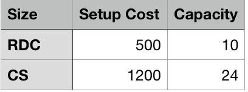
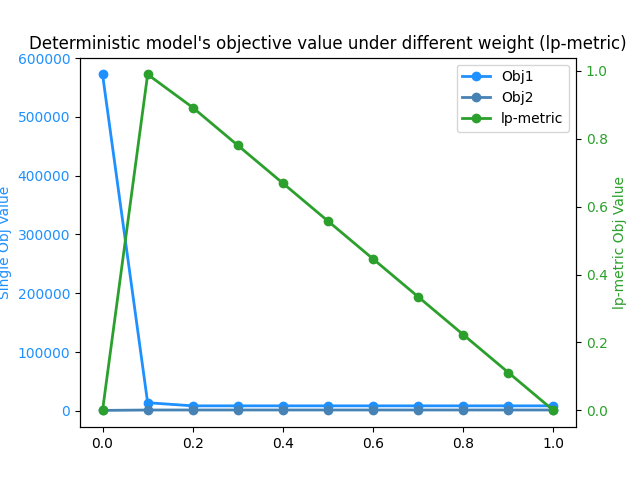
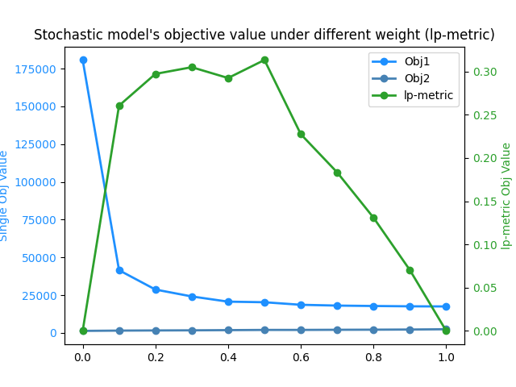
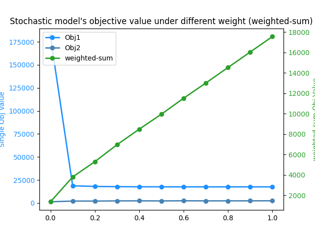
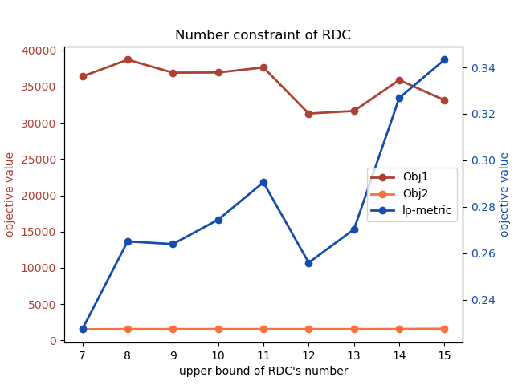
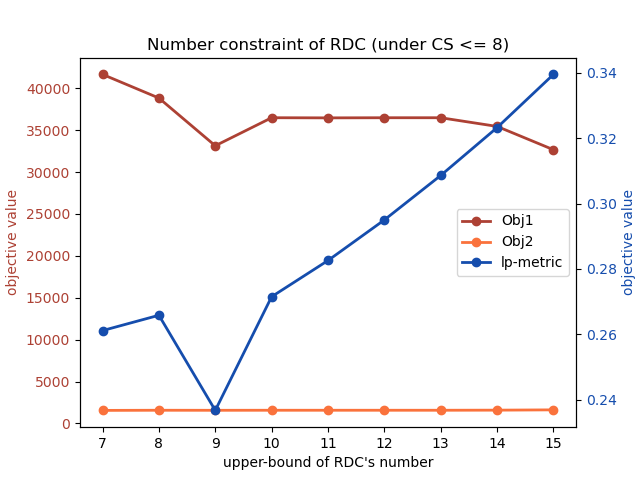

## ORA Term Project 2022
### Disaster Relief Logistics with Contactless Delivery Policy
### 2022 Fall

Team B

資訊所一 楊晴雯 P76114511

資訊所一 許智豪 P76114503


---

## Table of Contents
1. [Introduction](#Introduction)
    1.1 [Background: Disaster Relief Logistics](#Background:-Disaster-Relief-Logistics)
    1.2 [Abbreviation](#Abbreviation)
    1.3 [Motivation](#Motivation)
    1.4 [Problem Definition](#Problem-Definition)
2. [Methodology](#Methodology)
    2.1 [Formulation](#Formulation)
    2.2 [Multi-Objective Optimization](#Multi-Objective-Optimization)
3. [Case Study](#CaseStudy)
    3.1 [Data Collection](#DataCollection)
    3.2 [Implementation Details](#Implementation-Details)
    3.3 [Result Analysis](#Result-Analysis)
    3.4 [Weight Analysis](#weight-analysis)
    3.5 [Constraint on Number of CS/RDC Analysis](#Constraint-on-Number-of-CS/RDC-Analysis)
4. [Issues](#issues)
5. [References](#References)


## Introduction
### Background: Disaster Relief Logistics

Our project is inspired by "A multi-objective robust stochastic programming model for disaster relief logistics under uncertainty" by Ali bozorgi-Amiri et al, published on *OR Spectrum* in year 2011. Their model is a multi-objective model that aims to minimizes the total cost and its variance (as the first objective), and maximizes the satisfaction level of the least satisfied affected area (as the second objective). Since the disaster scale is stochastic, their model proposes to use discrete scenario analysis to include the stochastic factors.


### Abbreviations

RDC: Resource Distribution Center
CS: Contactless Station
AA: Affected Area


### Motivation
As Covid-19 threats gradually becomes a normality, it is a must to consider how to respond to a disaster under the pandemic. An imaginary scenario is that an earthquake damages a hospital that quarantines many Covid-19 confirmed cases, and now the resources need to be sent to this hospital without further human contacts. In this case, some contactless stations (CSs) need to be set up in place of the Amiri's proposed RDCs.
CSs send resources via self-driving cars, therefore avoid the risk brought by frequent human mobility in between. They also reduces the transportation costs because no drivers are needed. We imagine that CSs should have higher setup cost an dbetter capacity than RDCs.
The below compares the original paper setting and our proposed setting.
#### Amiri's Paper Setting

<figure>
  
  <figcaption>Figure 1. General resource distribution chain schema of Amiri's paper </figcaption>


#### Our Setting

<figure>
  
  <figcaption>Figure 2. Our revised general resource distribution chain schema </figcaption>


### Problem Definition
Amiri's paper models disaster planning and response capturing the inherent uncertainty in demand, supply, and cost resulting from the disaster. The model consists of 3 stages and 2 kinds of pair-wise transportation (Supplier-RDC, RDC-AA). Given constraints on transportation and the capacity limits in the 3 sets of nodes, the goal is to select optimum number of commodities in delivery from node to node, locations to set up RDCs, and capacitiy levels if an RDC is to be set up, while minimizing the total cost and the least satisified area's shortage cost. Amiri's paper goes further to wrap the objective functions with a robust optimization framework to guarantee small variance and model feasibility; we would like to skip the part as it makes the model too complicated.
In brief, we would like to mainly follow Amiri's paper formulation and multi-objective (bi-objective) setting, but with the following modifications:
1. Separating RDCs into standard RDCs (denoted RDC) and CSs (denoted CS).
2. Separating affected areas into high-risk and low-risk AAs, where high-risk AAs only receive resources from CSs, and low-risk AAs could receive from both.
3. Simplifying the constraints by removing the procure costs of commodities, and fixing the setup cost and capacity size for RDC (Amiri's paper has 3 setup costs with 3 sizes), and handcrafting a setup cost and a capacity size for CS.
4. Simplifying the objectives by removing the robust optimization framework described in the paper section 3 formula (13), and keeping only the naive $\xi$ for both objectives.

## Methodology

### Formulation

- Sets and Indices

    - $I$: Suppliers
    - $J$: Candidate points for RDCs and CCs
    - $K$: Affected Areas
    - $I$, For each $j \in J$, it is could be an RDC, or a CS, or none of the above, just an empty point.
    - $K'$: High-risk Affected Areas; Affected Areas that only receive commodities transported by CSs.
    - $K/K'$: Low-risk Affected Areas; Affected Areas that only receive commodities transported by RDCs.
    - $C$: Commodity Types.
    - $S$: Possible scenarios (discrete).


- Parameters

    (Deterministic Parameters)

    - $F^R$: fixed setup cost for RDCs.
    - $F^C$: fixed setup cost for CSs.
    - $C_{ijc}$: transportation cost from supplier $i$ to candidate point $j$ with commodity $c$.
    - $h_{kc}$: inventory holding cost for commodity $c$ at AA $k$.
    - $\pi_{c}$: inventory shortage cost for commdotiy $c$.
    - $v_{c}$: required unit space for commodity $c$.
    - $S_ic$: amount of commodity $c$ supplied by supplier $i$.
    - M: a large number

    (Stochastic Parameters)

    - $p_s$: occurrence of probability of scenario $s \ in S$.
    - $C_{ijcs}$: transportation cost from supplier $i$ to candidate point $j$ with commodity $c$ under scenario $s$.
    - $C_{jkcs}$: transportation cost from candidate point $j$ to AA $k$ with commodity $c$ under scenario $s$.
    - $D_{kcs}$: amount of demand of commodity $c$ under scenario $s$.
    - $\rho_{jcs}$: fraction of stocked materials of commodity $c$ remains usable at candidate point $j$ under scenario $s$ ($0 \leq \rho_{jcs} \leq 1$).
    - $\rho_{ics}$: fraction of stokced materials of commodity $c$ remains usdables at supplier $i$ under scenario $s$ ($0 \leq \rho_{ics} \leq 1$).

- Decision Variables

    - $Q_{ijc}$: amount of commodity $c$ supplied by supplier $i$, stored at candidate point $j$.
    - $X_{ijcs}$: amount of commodity $c$ transferred from supplier $i$ to candidate point $j$ under scenario $s$. If $X_{ijcs} > 0, j$ must be either an RDC or a CS.
    - $Y_{jkcs}$: amount of commodity $c$ transferred from candidate point $j$ to AA $k$ under scenario $s$. If $Y_{jkcs} > 0, j$ must be either an RDC or a CS.
    <!-- - $Y'_{j'jcs}$: amount of commodity $c$ transferred from candidate point $j'$ to another candidate point $j$ under scenario $s$. If $j' = j$, then $Y'_{j'jcs} = 0$. -->
    - $I_{kcs}$: amount of inventory of commodity $c$ held at AA $k$ under scenario $s$.
    - $b_{kcs}$: amount of shortage of commodity $c$ at AA $k$ under scenario $s$.
    - $\alpha_i$: if candidate point $j$ is an RDC, $\alpha_j = 1$; otherwise $=0$.
    - $\beta_j$: if candidate point $j$ is a CS, $\beta_j = 1$; otherwise $=0$.

- Mathematical Formulations

    These are defined for convenience and the simplicity in objective functions.

    - $\Sigma_{j \in J}(F^R\alpha_j + F^C\beta_j)$: (SC) Setup Cost for RDCs and CSs
    - $\Sigma_{i\in I}\Sigma_{j \in J}\Sigma_{c \in C}C_{ijc}Q_{ijc}$: Transportation Cost from suppliers to RDCs and CSs (preparedness phase).
    - $\Sigma_{i\in I}\Sigma_{j \in J}\Sigma_{c \in C}C_{ijcs}X_{ijcs}$:(TC-pre) Transportation Cost from suppliers to RDCs and CSs under a scenario (response phase).
    - $\Sigma_{i\in I}\Sigma_{k \in K}\Sigma_{c \in C}C_{jkcs}Y_{jkcs}$:(TC-post)Transportation Cost from RDCs and CSs to AAs under a scenario (response phase).
    - $\Sigma_{k \in k}\Sigma_{c \in C}h_{kc}I_{kcs}$:(IC) Inventory holding costs at AAs under a scenario (response phase).
    - $\Sigma_{k \in K}\Sigma_{c \in C}\pi_{c}b_{kcs}$:(SHC) Shortage costs at AAs under a scenario (response phase).


- Constraints
    The green parts are highlighted to indicate the revised parts from Amiri's paper.

    (1) **Control Balance Equation**: The amount of commodities sent from suppliers and other RDC/CS $j'$ to $j$ $-$ the amount $j$ sending out to other AA roughly equals to the amount of commodities transferred to AAs from the RDC $j$. If LHS is greater than the RHS, this inventory surplus is penalized by the first objective.
    <!-- (24) -->

    $$\Sigma_{i \in I} X_{ijcs} + \rho\Sigma_{i \in I}Q_{ijc} + {\color{green}\Sigma_{j' \neq j}{Y_{jj'cs}}\alpha_{j'}\beta_{j'}} - \Sigma_{k \in K}Y_{jkcs}(\alpha_j + \beta_j) = \delta_{jcs} \\ \forall j \in J, \forall c \in C, \forall s \in S$$

    (2) **Inventory Equality Constraint**: The amount of commodites from RDC/CS $j$ to AA $k -$ AA $k$'s demand should equal to $k$'s invnentory $- k$'s shortage. The revised part is the special case when $k$ is a special AA that could only receive commodites sent by a CS.

    <!-- (25)- -->
    <!-- 從rdc j 送到AA k 的貨 = k's inventory - k's shortage -->
    $$(\Sigma_{j \in J}Y_{jkcs} (\alpha_j + \beta_j)) -  D_{kcs} = I_{kcs} - b_{kcs} \\ \forall k \in K/K' \forall c \in C, \forall s \in S$$
    <!-- 從cs j 送special AA k' 的貨 = k' 's inventory - k' 's shortage -->
    $$\color{green} (\Sigma_{j \in J}Y_{jk'cs} (\alpha_j + \beta_j)) -  D_{k'cs} = I_{k'cs} - b_{k'cs} \\ \forall k' \in K' \forall c \in C, \forall s \in S$$


    (3) **RDC/CS Transferability**: RDC/CS could transfer commodity to other nodes only if there exists another RDC/CS/AA.
    <!-- (26) -->
    <!-- j is a RDC or a CS and k is a low-risk AA <=> j can send stuffs to k -->
    $$Y_{jkcs} \leq M(\alpha_j + \beta_j)D_{kcs} \\ \forall j \in J, \forall k \in K/K', \forall c \in C, \forall s \in S$$
    <!-- j is a cs and k' is a high-risk AA <=> j can send commods to k'-->
    $$\color{green} Y_{jk'cs} \leq M\beta_jD_{k'cs} \forall j \in J, \\ \forall k' \in K', \forall c \in C, \forall s \in S$$
    <!-- (28) -->

    $$\Sigma_{i \in I} {X_{ijcs} \leq M(\alpha_j + \beta_j)} \\ \forall j \in J, \forall c \in C, \forall s \in S$$

    (5) **RDC Capacity Constraint**: the amount of commodities sent from supplier $i$ to RDC $j$ should not exceed the capacity of the RDC. Similarly, the amount of commodities sent from supplier $i$ to CS $j$ should not exceed the capacity of the CS.
    <!-- (30) -->

    $$\Sigma_{i \in I}\Sigma_{c \in C} v_cQ_{ijc} \leq CapSize^R \cdot \alpha_j \forall j \in J$$
    $$\Sigma_{i \in I}\Sigma_{c \in C} v_cQ_{ijc} \leq CapSize^C \cdot \beta_j \forall j \in J$$

    (6) **Supplier Capacity Constraint (in preparedness phase):** The amount of commodities a supplier sends out to other places should not exceed the supplier's own capacity (before the disaster).
     <!-- (32) -->
    $$\Sigma_{j \in J} Q_{ijc} \leq S_{ic} \;\forall i \in I, \forall c \in C$$

    (7) **Supplier Capacity Constraint (in response phase):** The amount of commodities a supplier sends out to other places should not exceed the supplier's own capacity (after the disaster, under all scenarios).
     <!-- (33) -->
     $$\Sigma_{j \in J} X_{ijcs} \leq \rho_{ics} S_{ic} \;\forall i \in I, \forall c \in C, \forall s \in S$$

    (8) **RDC/CS Identity Constraint:** A node in set $J$ could only be (1) none (2) RDC (3) CS, but not RDC and CS simultaneously.
    <!-- (34) -->
    $$\alpha_j + \beta_j \leq 1 \;\forall j \in J$$

    (9) **CS Number Constraint:** $\epsilon$ is the maximum number of CSs allowed in the network.

    $$\color{green} \Sigma_{j \in J} \beta_j \leq \epsilon$$
- Objectives
    - Objective 1: minimize the total costs
    $SC + TC_{pre} + TC_{post}+ IC + SHC$
    Sometimes the input parameters make the model infeasible, so we add a penalty term $\delta$ to penalize the solutions that fail to meet the demand in a scenario or violate certain constraints, while keeping the model feasible. The final objective 1 is:
    $SC + TC_{pre} + TC_{post}+ IC + SHC + \gamma\Sigma_{j \in J}\Sigma_{c \in C}\Sigma_{s \in S}\delta_{jcs}$, where $\gamma$ is the weight of the penalty term.
    - Objective 2: maximize the total satisfaction; i.e., minimize the shortage costs of the least satisfied AA under all scenarios.
    $\Sigma_{s \in S}p_s(\Sigma_{c \in C}\max_{k \in K}{b_{cks}})$


### Multi-Objective Optimization

 There are several methods to solve a multi-objective problem, as can be found in past literatures (Mahjoob, M. and Abbasian, P., 2018; Kong, Z. Y., How, B. S., Mahmoud, A., & Sunarso, J., 2022; Yang, Z. et al., 2014). We employ the following 2 methods to combine our 2 objectives together, and solve the problem as a single-objective problem.

#### Weighted-Sum Method
Both objectives are assigned a positive weight ($w$ for $Obj_1$, $0 \leq w \leq 1$) and the goal is to minimize the weighted sum of both objective functions. An issue is that $Obj_1$ involves $Obj_2$, so it must be numerically greater than the latter, therefore assigning a small enough $w$ is important to avoid the dominance of the total cost over AA satisfaction.
$$\min w * Obj_1 + (1 - w) * Obj_2$$


#### Lp-Metric Method
The Lp-metric method aims to reduce the digression btween objective functions and their ideal solution obtained by indiviually optimizing them. In order to obtain the $Obj^*$, we need to solve the problem with only one objective at a time (optimize twice) and then plug in the $Obj^*$ values, so there's 3 times of optimization in total.

$$\min w * {\frac{Obj_1 - Obj_1^*}{Obj_1^*}} + (1 - w) * {\frac{Obj_2 - Obj_2^*}{Obj_2^*}}$$


## Case Study

### Data Collection
We use the data in case study from Amiri's paper. The scene is set at a well-populated region of Iran located near sourthern Central Alborz, with several active faults surrounding (hence the disaster is imagined to be an earthquake).
1. $I$ contains 5 suppliers, including Sari, Qazvin, Tehran, Arak and Isfahan.
2. $J$ contains 15 candidate nodes, including Gorgan, Semnan, Sari, Rasht, Qazvin, Karaj, Tehran, Varamin, Roibatkarim, Islamshahr, Shahriar, Gom, Arak, Isfahan and Kashan. Their pair-wise distance statistics are shown in figure 3. The setup costs of an RDC ($F^R$) and a CS ($F^C$) are shown in figure 3.
3. $K$ contains 15 demand points (AAs). The first 8 nodes are low-risk AAs while the later 7 are high-risk ones (the former is denoted $K/K'$ while the latter is denoted $K'$). Their demands under all scenarios ($D_{kcs}$) are shown in figure 4. The capacity of AA is an arbitrary value set to 16 (same unit as the capacity of an RDC and CS).
4. $C$ is the set of commodities, here we use water, food, and shelter.
5. $S$ is the set of scenarios with occurrence probabilites $p_s = [0.45, 0.3, 0.1, 0.15]$.

Note that $I$ is a subset of $J$, and $J = K$ in terms of the distance statistics. We assume that, for example, if Sari is an affected area and a RDC in a solution, it means the area and the center are located in different geographical locations within the province Sari. In this way we could reuse the distance statistis. We virtually see $J$ and $K$ as 2 sets of nodes with different property to avoid confusion. Same reasoning goes for the subset condition of $I \subseteq J$.


<figure>
  
  <figcaption>Figure 1. Distance matrix</figcaption>
</figure>


<figure>
  
  <figcaption>Figure 2. Supplier and their capacity with respect to commodity type</figcaption>
</figure>
  

  Figure 5. $\rho_{jcs}$ and $\rho_{ics}$; the fraction of stocked materials that remain usable (unit: %).


<figure>
  
  <figcaption>Figure 3. Setup cost for RDC and CS</figcaption>
</figure>

<figure>
  
  <figcaption>Figure 4. Demands of each AA under different scenarios.</figcaption>
</figure>

### Implementation Details
We decide to solve the problem using Gurobi Optimization solver with the academic license. The environment is Gurobi 10.0.0 with Python 3.7.12 under the *Linux x86_64 system with 12th Gen Intel(R) Core(TM) i7-12700*.
In Gurobi implementation, we use the `setObjectiveN()`  that defaults to weighted-sum method according to the official documentation ([gurobi doc 9.1: Working with Multiple Objective](https://www.gurobi.com/documentation/9.1/refman/working_with_multiple_obje.html)) for both weighted-sum and Lp-metric strategies.

### Result Analysis

#### Modeling
We start simple with a **deterministic model** first. It assumes that in the response phase, we have perfect knowledge of which scenario would happen, so the *demand, transportation cost, and the fraction of stocked materials that remain usable* are pre-determined. In the following experiments, we choose to use the scenario $s1$. We do not extensively discuss on this model but record its statistics for reference.
Our final model is the **stochastic model**, which has the same setting as the deterministic one in preparedness phase; in response phase, it considers 4 scenarios representing earthquakes of different epicenters and potential earthquake intensity.


#### Solution

The final stochastic programming model has 4,422 continuous variables and 210 binary variables; 666 quadratic constraints and 12 general constraints. The optimization procedure takes 0.81 seconds for over 4,000 simplex iterations. The below shows the statistics for the configuration:
```
stochastic model
objective 1 weight = 0.1
number of CS (epsilon) = 8
optimization method: Lp-metric
```
As seen in figure [alpha_beta], there are 8 CSs and 7 RDCs opened, which means that each node in candidate node set $J$ must be either a RDC or a CS. It is observed that all of the values in $Q_ijc$ are zeros, meaning that none of the commodities are stored in the preparedness phase. All the shippings start from the response phase.

Figure [X_ijcs] shows the amount of commodity $c$ shipped from supplier $i$ to RDC in $j$ under scenario $s$. Here we <span style="color:red"> discover that RDC does not receive anything in both phases, so the figure only shows columns of CSs.</span> We could see that the supplier in Sari ships 117 units of food under all scenarios; 39 units of shelter under scneario 3 and 4; 0 water under scneario 1 and 117 units of water under the rest, to the CS in the same province. Averagely speaking, the 3 commdoites sent to the same CS are usually supplied by the same supplier.

Figure [Y_jkcs] shows the amount of commodity $c$ shipped from RDC $j$ to AA $k$ under scenario $s$. It is calculated that commodity water and food have 636 units per shipping, while shelter ships 184.24 per shipping. It may be that Shelter costs the most for transportation compared to the other 2.


<!--  -->


Figure [I_kcs] and [b_kcs] represent the inventory and shortage amount held at AA $k$ under scenario $s$. The inventory balance equation constraint regulates that $I_{kcs} - b_{kcs}$ should equal to the total amount of commdoities sent in minus those in store; holding inventory and having shortage all have a penalty cost exerted on objective 1. We could observed that due to high transportation cost on shelters, the shortage of shelter is prevalent for all AAs and no AAs hold shelter inventory.


### Weight Analysis

| | Lp-metric  &nbsp; &nbsp;| Weighted-sum &nbsp; &nbsp; |
| :------------ | :-------------------------:| :-------------:|
Deterministic |  |  
Stochastic |  |  

With single-objective optimization, we can minimize the total costs to $11,950$ ($10^6\$$) and the maximum shortage costs to $1,364$ ($10^6\$$) for stochastic model with Lp-metric. The combined objective of weighted-sum and Lp-metrics are then chosen to use to coordinate the 2 objectives.
In terms of the modeling method, the stochastic model gives more fluctuating line than the deterministic one. In terms of the optimization method, the weighted sum gives a very stable tendency; as $w$ increases, objective 1 is placed more weight and therefore the weighted objective grows rapidly. Due to the different numeric scales for both objectives; objective 1 accumulates all costs so it falls around $10^4$, while objective 2 is around $10^3$ (5 times smaller). Therefore, the Lp-metric, which aims to minimize the digression between the objective and its ideal solution, is more suitable for this problem. The overall tendency of the 2 optimization methods are the opposite: as $w$ increases, weighted-sum objective grows, while Lp-metric objective decreases.
As for the single-objectives, it's clear that objective 1 and 2 have a trade-off in=between. A higher total cost leads to higher satisfaction (less shortage in AAs), vice versa.


### Constraint on Number of CS/RDC Analysis
Stochastic Model
| | CS  &nbsp; &nbsp;| RDC &nbsp; &nbsp;| RDC+CS &nbsp; &nbsp; |
| :------------ | :-------------------------:| :-------------:| :-------------:|
w/o Delta(δ) |  |    |   |
w/ Delta(δ)|  |    |   |

The deviation ($\delta$) indicates an increased commodity inventory penalized by the last
term of the first objective function. It can be observed that after adding the penalty term, the model can be further optimized.


## Issues

A node could be a RDC, a CS or a null node that does not open any centers, however, our model only allows a node to be either a RDC or a CS. We attempt to fix the problem by adding the penalty term $\delta$, and let the model optimize for infeasibility. Unfortunately, the model still goes infeasible under conditions that the numbers of CS and RDC do not sum to the total number of candidate nodes ($|J|$).

## Conclusion

Our lp-metric with w tendency is the same as Amiri's paper fig 7.

## References
- Bozorgi-Amiri, A., Jabalameli, M.S. & Mirzapour Al-e-Hashem, S.M.J. A multi-objective robust stochastic programming model for disaster relief logistics under uncertainty. OR Spectrum 35, 905–933 (2013).[link](https://doi.org/10.1007/s00291-011-0268-x)
- Blank, J., & Deb, K. (2020). Pymoo: Multi-objective optimization in python. IEEE Access, 8, 89497-89509. [link](https://ieeexplore.ieee.org/document/8950979)
- Kong, Z. Y., How, B. S., Mahmoud, A., & Sunarso, J. (2022). Multi-objective Optimisation Using Fuzzy and Weighted Sum Approach for Natural Gas Dehydration with Consideration of Regional Climate. Process Integration and Optimization for Sustainability, 1-18. [link](https://doi.org/10.1007/s41616-021-00195-9)
- Mahjoob, M. (2018). Designing a cost-time-quality-efficient grinding process using MODM methods. arXiv preprint arXiv:1804.10710. [link](https://arxiv.org/abs/1804.10710)
- Yang, Z., Cai, X., & Fan, Z. (2014, July). Epsilon constrained method for constrained multiobjective optimization problems: some preliminary results. In Proceedings of the companion publication of the 2014 annual conference on genetic and evolutionary computation (pp. 1181-1186).